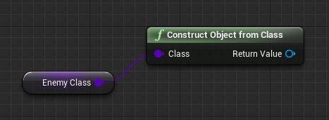
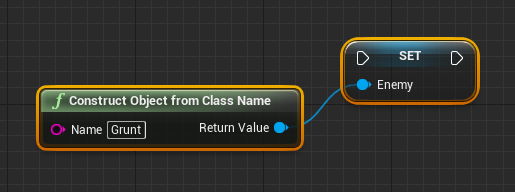

# Blueprint Reflection

This is a plugin for Unreal Engine 4 that adds reflection capabilities to the blueprint system.

## Functions

### Get Class By Name

The Get Class By Name blueprint function can be used to retrieve a Class (UClass) object by providing its name.

### Construct Object From Class

The Construct Object From Class blueprint function can be used to create an instance of any class that derives from Object (UObject).

### Construct Object From Class Name

The Construct Object From Class Name blueprint function can be used to create an instance of any class that derives from Object (UObject) by providing the name of the class.

